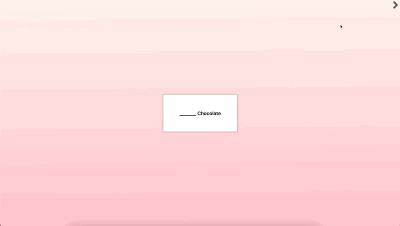

# Blank Slate - "Will you be my Valentine?" Edition

An application that adds a "Will you be my Valentine?" spin to the [_Blank Slate_](https://theop.games/products/blank-slate-challenge?srsltid=AfmBOoofVi_J1ulslUaqVSaP3u2QElHsn-cFQ1h0CKzxXwbOVdQpLMtP) card game built using React.js with TypeScript.

## Table of Contents
* [General Info](#general-information)
* [Technologies Used](#technologies-used)
* [Showcase](#screenshots)
* [Setup](#setup)
* [Usage](#usage)
* [Contact](#contact)

## General information

An application that mimics the rules of the Blank Slate card game (i.e. players attempting to unknowingly match words that complete a phrase with another person) with four forward and rear facing navigable cards. The unique twist is flipping the final card reveals a "Will you be my Valentine?" message fashioned with flowing flower petals and [_"My Love Mine All Mine" by Mitski_](https://www.youtube.com/watch?v=CwGbMYLjIpQ) playing in the background! 

The reason why I built this was for two simple reasons:
* It's a game my girlfriend and I love to play together.
* To impress my girlfriend on Valentine's Day...it worked! :two_hearts:

## Showcase

## Technologies Used

* React v18.3.1
* TypeScript v4.9.5

## Setup

To setup the application, [_npm_](https://docs.npmjs.com/downloading-and-installing-node-js-and-npm) or [_yarn_](https://classic.yarnpkg.com/lang/en/docs/install/#mac-stable) are required.

1. Open your terminal and `git clone` the GitHub repository URL in your desired directory.
2. Navigate to the cloned directory with `cd <cloned_repository>` and install the project's dependencies with `npm install` or `yarn install`.
3. Run the application with `npm start` or `yarn start`.

## Usage

The usage is pretty simple. You can flip the card by clicking onto it and to navigate to the next card by clicking the top-right arrow.

## Contact

The application was created by yours truly! Feel free to follow me on [_LinkedIn_](https://www.linkedin.com/in/ahmed-gorashi-546447b5/) and let me know if this worked on your significant other! :relaxed:

